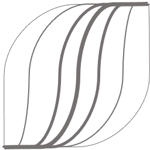
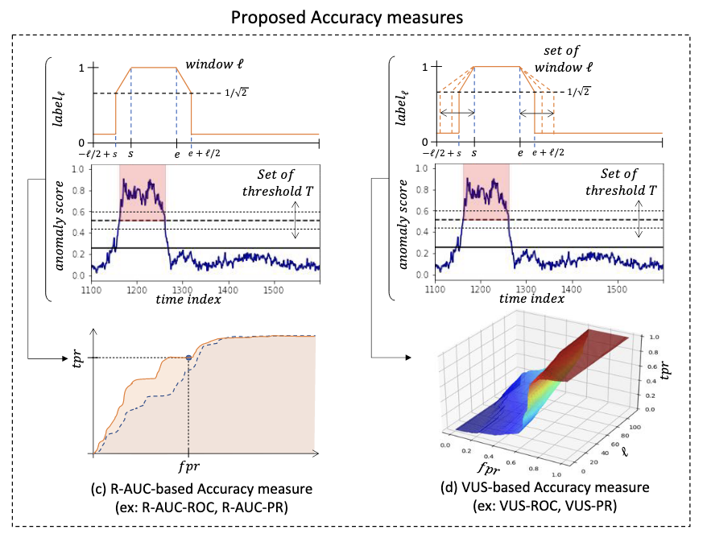

<p align="center">

</p>


<h1 align="center">Volume Under the Surface</h1>
<h2 align="center">A New Accuracy Evaluation Measure for Time-Series Anomaly Detection</h2>

<div align="center">
<p>
   
</p>
</div>


The receiver operator characteristic (ROC) curve and the area under the curve (AUC) are widely used to compare the performance of different anomaly detectors. They mainly focus on point-based detection. However, the detection of collective anomalies concerns two factors: whether this outlier is detected and what percentage of this outlier is detected. The first factor is not reflected in the AUC. Another problem is the possible shift between the anomaly score and the real outlier due to the application of the sliding window. To tackle these problems, we incorporate the idea of range-based precision and recall, and suggest the range-based ROC and its counterpart in the precision-recall space, which provides a new evaluation for the collective anomalies. We finally introduce a new measure VUS (Volume Under the Surface) which corresponds to the averaged range-based measure when we vary the range size. We demonstrate in a large experimental evaluation that the proposed measures are significantly more robust to important criteria (such as lag and noise) and also significantly more useful to separate correctly the accurate from the the inaccurate methods.

<p align="center">

</p>

If you use VUS in your project or research, cite the following two papers:

* [VLDB 2022a](https://www.paparrizos.org/papers/PaparrizosVLDB22a.pdf)
* [VLDB 2022b](https://www.paparrizos.org/papers/PaparrizosVLDB22b.pdf)

## References

> "Volume Under the Surface: A New Accuracy Evaluation Measure for Time-Series Anomaly Detection"<br/>
> John Paparrizos, Paul Boniol, Themis Palpanas, Ruey Tsay, Aaron Elmore, and Michael Franklin<br/>
> Proceedings of the VLDB Endowment (**PVLDB 2022**) Journal, Volume 15, pages 2774‑2787<br/>

```bibtex
@article{paparrizos2022volume,
  title={{Volume Under the Surface: A New Accuracy Evaluation Measure for Time-Series Anomaly Detection}},
  author={Paparrizos, John and Boniol, Paul and Palpanas, Themis and Tsay, Ruey S and Elmore, Aaron and Franklin, Michael J},
  journal={Proceedings of the VLDB Endowment},
  volume={15},
  number={11},
  pages={2774--2787},
  year={2022},
  publisher={VLDB Endowment}
}

```

> "TSB-UAD: An End-to-End Benchmark Suite for Univariate Time-Series Anomaly Detection"<br/>
> John Paparrizos, Yuhao Kang, Paul Boniol, Ruey Tsay, Themis Palpanas, and Michael Franklin.<br/>
> Proceedings of the VLDB Endowment (**PVLDB 2022**) Journal, Volume 15, pages 1697–1711<br/>

```bibtex
@article{paparrizos2022tsb,
  title={Tsb-uad: an end-to-end benchmark suite for univariate time-series anomaly detection},
  author={Paparrizos, John and Kang, Yuhao and Boniol, Paul and Tsay, Ruey S and Palpanas, Themis and Franklin, Michael J},
  journal={Proceedings of the VLDB Endowment},
  volume={15},
  number={8},
  pages={1697--1711},
  year={2022},
  publisher={VLDB Endowment}
}
```
> "Local Evaluation of Time Series Anomaly Detection Algorithms", 
> Accepted in KDD 2022 Research Track: Proceedings of the 28th ACM SIGKDD Conference on Knowledge Discovery and Data Mining.
>  [Affiliation Metrics](https://github.com/ahstat/affiliation-metrics-py)

## Data

To ease reproducibility, we share our results over [TSB-UAD](http://chaos.cs.uchicago.edu/tsb-uad/public.zip) benchmark dataset

## Installation

### Install from [pip](https://pypi.org/project/vus/)

```
$ pip install vus
```

### Create Environment and Install Dependencies

```
$ conda env create --file environment.yml
$ conda activate VUS-env
$ pip install -r requirements.txt
```

### Install from source
```
$ git clone https://github.com/johnpaparrizos/VUS
$ cd VUS/
$ python setup.py install
```

## Experiments

### Analysis of the Ranks over different Accuracy Measures for all Methods:

|	| AUC_PR|	AUC_ROC|	R_AUC_PR|	R_AUC_ROC|	VUS_PR|	VUS_ROC|Precision@k|	Recall|	Precision|	Rrecall|	Rprecision|	F|	RF|	
|:--|:---------:|:-------:|:--------:|:-------:|:-----------:|:---:|:----:|:----:|:----:|:-----:|:----:|:----:|:----:|
|NormA| 4.253773|	4.103623|	4.298602|	4.379906|	4.293008|	4.300858|	4.210485|	4.249889|	4.787366|	4.559922|	4.463738|	4.425060|	4.650611|
|POLY| 4.686958|	4.704703|	4.535406|	5.050737|	4.473394|	4.983283|	5.384482|	4.903971|	4.994008|	5.109559|	4.855465|	4.920786|	5.006390|
|IForest| 4.540955|	4.301471|	4.570341|	4.406066|	4.621100|	4.406458|	5.042205|	5.114203|	5.075445|	5.849549|	4.820506|	5.103598|	5.547707|
|AE| 4.913290|	4.825540|	4.842853|	4.684716|	4.847660|	4.650359|	4.880552|	4.953687|	4.640731|	5.279224|	4.740862|	4.838507|	4.919577|
|OCSVM| 5.454006|	5.501606|	5.324205|	5.368112|	5.321574|	5.449086|	5.697530|	5.753513|	5.064816|	5.559130|	5.503605|	5.595893|	5.493684|
|MatrixProfile| 5.565779|	5.264788|	5.136523|	5.087060|	5.196917|	5.173278|	5.145945|	5.191028|	5.589128|	5.379395|	5.707388|	5.390321|	5.671893|
|LOF| 4.648609|	4.715578|	3.911382|	4.209517|	3.944675|	4.308522|	4.661508|	4.706821|	4.491874|	4.760564|	4.481798|	4.699444|	4.886699|
|LSTM| 5.705758|	6.162379|	6.581456|	6.348949|	6.559446|	6.288700|	5.089040|	5.163219|	5.363024|	4.345831|	5.339533|	5.122215|	4.496773|
|CNN| 5.230872|	5.420312|	5.799231|	5.464937|	5.742226|	5.439456|	4.888253|	4.963668|	4.993608|	4.156825|	5.087105|	4.904176|	4.326666|

### Robustness to Lag: 

Top figure depicts the average standard deviation for ten different lag values over the AD methods applied on the MBA(805) time series. Bottom figure depicts the accuracy (measured 10 times) with random lag ℓ ∈ [−0.25 ∗ ℓ, 0.25 ∗ ℓ ] injected in the anomaly score with average accuracy centered to 0.

<p align="center">

</p>

### Separability Analysis: : 

Applied on 8 pairs of accurate (in green) and inaccurate (in red) methods on MBA(805) data.

<p align="center">

</p>

### Also see notebooks  in [experiments](https://github.com/bogireddytejareddy/VUS/tree/main/experiments) folder for more analysis on Roubstness, Separability and Entropy.

## Usage

We depicts below a code snippet demonstrating how to use our measure.

### Compute measure

```python
import math
import numpy as np
import pandas as pd
from vus.models.feature import Window
from vus.metrics import get_metrics
from sklearn.preprocessing import MinMaxScaler


def anomaly_results(X_data):
    # Isolation Forest
    from vus.models.iforest import IForest
    IF_clf = IForest(n_jobs=1)
    x = X_data
    IF_clf.fit(x)
    IF_score = IF_clf.decision_scores_

    return IF_score


def scoring(score, labels, slidingWindow):
    # Score normalization
    score = MinMaxScaler(feature_range=(0,1)).fit_transform(score.reshape(-1,1)).ravel()
    score = np.array([score[0]]*math.ceil((slidingWindow-1)/2) + list(score) + [score[-1]]*((slidingWindow-1)//2))

    results = get_metrics(score, labels, metric='all', slidingWindow=slidingWindow) # default metric='vus'

    for metric in results.keys():
        print(metric, ':', results[metric])


# Data Preprocessing
slidingWindow = 100 # user-defined subsequence length
dataset = pd.read_csv('./data/MBA_ECG805_data.out', header=None).to_numpy()
data = dataset[:, 0]
labels = dataset[:, 1]
X_data = Window(window = slidingWindow).convert(data).to_numpy()

if_score = anomaly_results(X_data)
print('Isolation Forest')
scoring(if_score, labels, slidingWindow)
```

```
Isolation Forest
AUC_ROC : 0.9263301592778213
AUC_PR : 0.6973053569232922
Precision : 0.8200118413262285
Recall : 0.41138613861386136
F : 0.5479000461528318
Precision_at_k : 0.41138613861386136
Rprecision : 0.7840823900854653
Rrecall : 0.29697975549209193
RF : 0.4307922489855251
R_AUC_ROC : 0.9892262823191413
R_AUC_PR : 0.946785752183305
VUS_ROC : 0.9744692546344875
VUS_PR : 0.8988057857811111
Affiliation_Precision : 0.9657740519979081
Affiliation_Recall : 0.9877594760008377
```

### SlidingWindow parameter

Note that Range_auc and VUS measures need a slidingWindow parameter. This parameter corresponds to the buffer length for Range_auc and the maximal buffer length for VUS. This parameter can be set using the following strategies:

* **External Knowledge**: For a given dataset, slidingWindow should be set to the labeled_anomaly length (for instance, the median labeled anomaly length).

* **Automatic estimation**: For each dataset, we can automatically estimate the slidingWindow. In order to do this, we use auto-correlation. Please see the code snippets below for each strategy.

#### SlidingWindow parameter: External Knowledge

Example on how to set the slidingWindow parameter to the median anomaly length of the time series:

```python
import numpy as np
import pandas as pd
from vus.models.feature import Window
from vus.utils.utility import get_list_anomaly

# Data Preprocessing
dataset = pd.read_csv('./data/MBA_ECG805_data.out', header=None).to_numpy()
data = dataset[:, 0]
labels = dataset[:, 1]

# set to the mean anoamly length in the time series
slidingWindow = int(np.median(get_list_anomaly(labels)))
print("slidingWindow parameter: ",slidingWindow)

#Build dataset
X_data = Window(window = slidingWindow).convert(data).to_numpy()

```
```
slidingWindow parameter:  102
```

#### SlidingWindow parameter: Automatic estimation

Example on how to set the slidingWindow parameter to the period of the time series:

```python
import numpy as np
import pandas as pd
from vus.models.feature import Window
from vus.utils.slidingWindows import find_length

# Data Preprocessing
dataset = pd.read_csv('./data/MBA_ECG805_data.out', header=None).to_numpy()
data = dataset[:, 0]
labels = dataset[:, 1]

# set to the mean anoamly length in the time series
slidingWindow = find_length(data)
print("slidingWindow parameter: ",slidingWindow)

#Build dataset
X_data = Window(window = slidingWindow).convert(data).to_numpy()

```
```
slidingWindow parameter:  99
```

