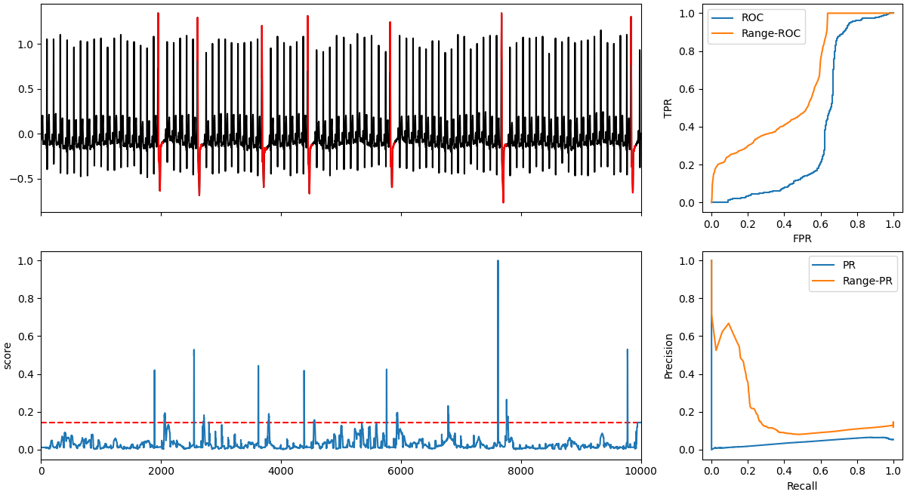
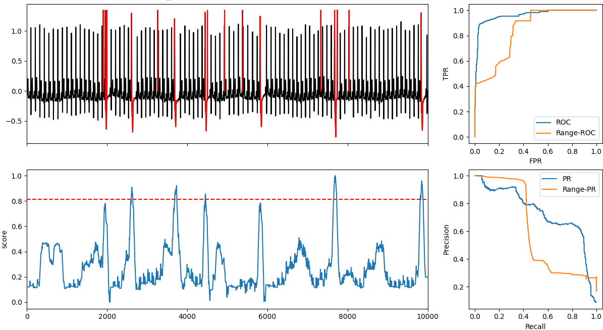
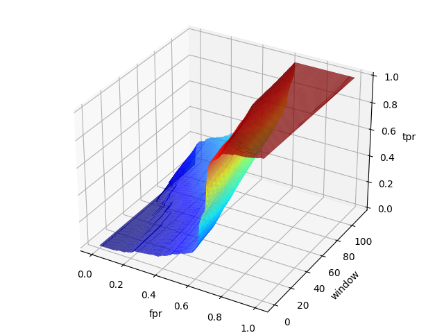

# RangeAUC

The receiver operator characteristic (ROC) curve and the area
under the curve (AUC) are widely used to compare the performance
of different anomaly detectors. They mainly focus
on point-based detection. However, the detection of collective
anomalies concerns two factors: whether this outlier is
detected and what percentage of this outlier is detected. The
first factor is not reflected in the AUC. Another problem is the
possible shift between the anomaly score and the real outlier
due to the application of the sliding window. To tackle these
problems, we incorporate the idea of range-based precision
and recall, and suggest the range-based ROC and its counterpart
in the precision-recall space, which provides a new
evaluation for the collective anomalies.

RangeAUC is a generalized version of
AUC for the subsequence outlier with the following goals:
* Inertial to the boundary of subsequence outlier. a high
anomaly score near the border of outlier should be rewarded.
* Sensitive to the short subsequence outlier detection. failing to detect a short subsequence should be penalized.

## Example

Examples are available in example_RangeAUC.ipynb

## Comparison between AUC and rangeAUC 

* The mismatch between the anomaly score and subsequence anomaly.

RangeAUC gives the anomaly detector partial credits when there is some mismatch
between the outlier and anomaly score. Below presents the
result of LOF. Each anomaly score peak does correspond to
a subsequence outlier. However, the position of each peak
is slightly ahead of the starting point of the outlier



The right panel presents the ROC and PR
curves for the point-based and range-based estimation. The
range-AUC=0.61, which is much higher than AUC=0.38.
The larger range-AUC is because we use the buffer region to
extend the effective positive range. On the other hand, rangeAUC is still far from 1 since the algorithm only indicates the
beginning of each outlier but fails to show its range.

* Misclassification of narrow anomaly.



Range-AUC can sensitively detect the misclassification of narrow anomalies. Above figure is ECG data with some
short-range outlier with outlier ratio=0.005. Each short outlier only contains 5 points, and their maximum value is comparable to the original peak of the time series. In this case,
model HBOS successfully detects long outliers (length ∼
80) but fails to catch these short outliers (length ∼5). The
point-based ROC still has AUC=0.96, which is reasonable
because the ignorance of short outlier does not decrease TPR
too much. In contrast, Range-AUC=0.84 because we penalize the method when the Existence ratio is low. A similar
thing occurs in the PR curve, where the area below rangePR is much smaller than point-based PR curve.

## Volume-AUC.


A variant version of rangeAUC is to scan different windows from 0
to the period of the series. Then the average rangeAUC is the volume under the TPR-FPR-window surface divided by the range of the window. 


## Cite this Work:
If you find this  work useful, you may cite this work:
```
```
